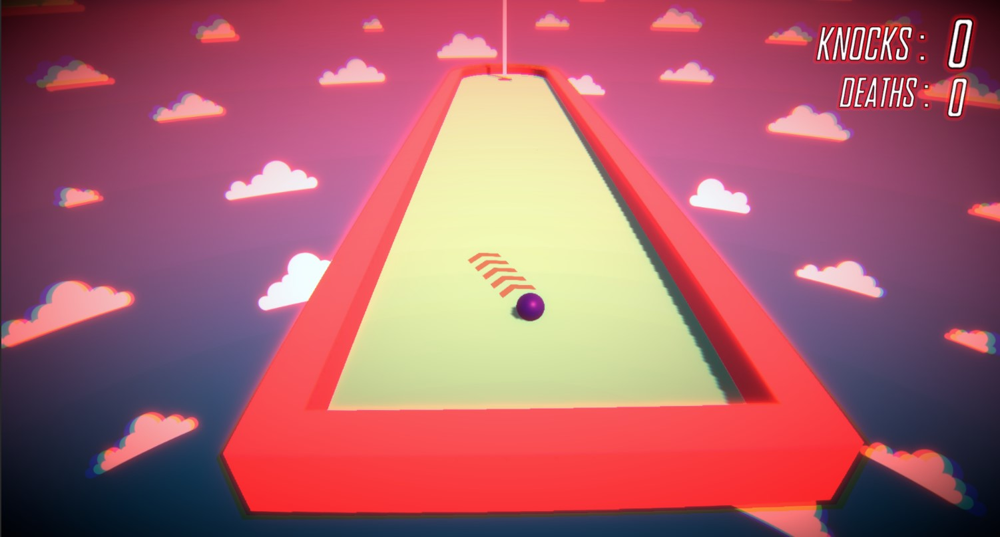

# Sky Golf - A Unity Arduino experiment

A simple golf game made in Unity integrating with a new controller using arduino with potetiometer, peizoelectric sensor and touch sensors as player inputs

## Gameplay

